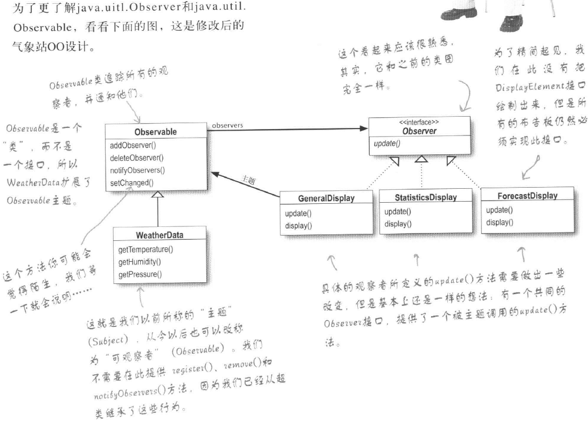

# 第二章 观察者模式

### 观察者模式

定义了对象之间的一对多依赖，这样一来，当一个对象改变状态时，它的所有依赖者都会收到通知并自动更新。


### 本章目的

#### 建立一个应用利用WeatherData对象取得气象站数据，并更新3个公告板


如果我们在measurementsChanged\(\)方法中写入我们更新三个公告板的方法，那么会有哪些问题呢


### 采用设计模式来改善我们的设计


### 代码实现观察者模式

#### 主题接口

```java
/**
 * @Author ys2000
 * @Date 2019/7/15 14:15
 * @Description 主题对象
 **/
public interface Subject {
    /**
     * 注册观察者对象
     */
    void registerObserver(Observer observer);

    /**
     * 移除观察者对象
     */
    void removeObserver(Observer observer);
}
```

#### 观察者模式接口

```java
/**
 * @Author ys2000
 * @Date 2019/7/15 14:15
 * @Description 观察者对象  主体：观察者 = 1 ： N
 **/
public interface Observer {
    /**
     * 更新
     * @param temp
     * @param time
     */
    void update(float temp,float time);
}
```

#### 观察者-公告板1

在上面的类图中，所有的观察者还应该实现一个公共的Display接口，这是具体业务所需要，这里省略

```java
/**
 * @Author ys2000
 * @Date 2019/7/15 14:24
 * @Description公告板1
 **/
public class DisplayOne implements Observer {
    private Subject subject;
    private float temp;
    private float time;

    public DisplayOne(Subject subject) {
        this.subject = subject;
        subject.registerObserver(this);
    }

    @Override
    public void update(float temp,float time) {
        this.temp = temp;
        this.time = time;
        System.out.println("第一个温度板" +
                " temp:"+temp + ", time:"+time);
    }
}
```

#### 主题具体对象

```java
/**
 * @Author ys2000
 * @Date 2019/7/15 14:17
 * @Description
 **/
public class WeatherData implements Subject {
    //内部需要将所有观察者引用保存起来，用于通知观察者
    private ArrayList<Observer> observers;
    private float temp;
    private float time;

    public WeatherData() {
        observers = new ArrayList<>();
    }

    @Override
    public void registerObserver(Observer observer) {
        observers.add(observer);
    }

    @Override
    public void removeObserver(Observer observer) {
        observers.remove(observer);
    }
    
    public void setValue(float temp,float time){
        this.temp = temp;
        this.time = time;
        notifyObservers();
    }
    //通知所有观察者
    public void notifyObservers(){
        for (Observer observer : observers) {
            observer.update(temp, time);
        }
    }

    @Override
    public String toString() {
        return "WeatherData{" +
                "temp=" + temp +
                ", time=" + time +
                '}';
    }
}
```

#### 测试

```java
public class ObserverTest {
    public static void main(String[] args) {
        WeatherData weatherData = new WeatherData();
        DisplayOne displayOne = new DisplayOne(weatherData);
        DisplayTwo displayTwo = new DisplayTwo(weatherData);
        weatherData.setValue(40.0f, 123456f);
        weatherData.setValue(50.5f, 321f);
    }
}
```

### JDK内置观察者模式

内置的观察者有一个缺点，Observable是一个类，导致我们的“主题”对象必须继承自它，又因为Java不支持多继承，所以限制了“主题”对象的使用场景。



内置的观察者模式为我们提供了新的给观察者传递数据的方式，观察者可以从主题中拉取数据，或者从主体主动推送给观察者

```java
public interface Observer {
    /**
     * 当观察者的update方法被调用时，观察者可以从“主体”Observable 中直接get所需的方法
     * 也可以从arg中直接获取 arg由我们自定义，当然也可以不传
     *
     * @param   o     主体对象
     * @param   arg   推送过来的数据推线
     */
    void update(Observable o, Object arg);
}
```

